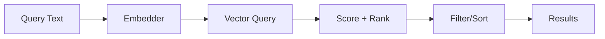

# User Journey: Semantic Tool Search

## Scenario

You want to retrieve tools by intent rather than exact name matching. The query
"summarize meeting notes" should return tools tagged for summarization.

## Step 1: Build a semantic index

```go
index := toolsemantic.NewIndex()
index.Add(toolDoc)
```

## Step 2: Query the index

```go
searcher := toolsemantic.NewSearcher(index)
results, _ := searcher.Query(ctx, "summarize meeting notes")
```

## Step 3: Filter results

```go
filtered := toolsemantic.FilterByNamespace(results, "docs")
```

## Flow Diagram


