# User Journey: Semantic Tool Search

## Scenario

You want to retrieve tools by intent rather than exact name matching. The query
"summarize meeting notes" should return tools tagged for summarization.

## Step 1: Build a semantic index

```go
idx := toolsemantic.NewInMemoryIndex()
_ = idx.Add(ctx, toolsemantic.Document{
    ID:          "docs:summarize",
    Namespace:   "docs",
    Name:        "summarize",
    Description: "Summarize a document",
    Tags:        []string{"summarize", "read"},
})
```

## Step 2: Query the index

```go
strategy := toolsemantic.NewBM25Strategy(nil)
searcher := toolsemantic.NewSearcher(idx, strategy)
results, _ := searcher.Search(ctx, "summarize meeting notes")
```

## Step 3: Filter results

```go
filtered := make([]toolsemantic.Result, 0, len(results))
for _, r := range results {
    if r.Document.Namespace == "docs" {
        filtered = append(filtered, r)
    }
}
```

## Flow Diagram

```mermaid
%%{init: {'theme': 'base', 'themeVariables': {'primaryColor': '#6b46c1'}}}%%
flowchart LR
    subgraph input["Input"]
        A["🔍 Query Text<br/><small>'summarize meeting notes'</small>"]
    end

    subgraph embedding["Embedding"]
        B["🧠 Embedder<br/><small>text → vector</small>"]
    end

    subgraph search["Vector Search"]
        C["📊 Vector Query<br/><small>cosine similarity</small>"]
        D["🏆 Score + Rank"]
    end

    subgraph filtering["Post-Processing"]
        E["🔍 Filter/Sort<br/><small>namespace, threshold</small>"]
    end

    subgraph output["Output"]
        F["📋 Results<br/><small>Document[] with scores</small>"]
    end

    A --> B --> C --> D --> E --> F

    style input fill:#3182ce,stroke:#2c5282
    style embedding fill:#6b46c1,stroke:#553c9a,stroke-width:2px
    style search fill:#d69e2e,stroke:#b7791f
    style filtering fill:#38a169,stroke:#276749
    style output fill:#3182ce,stroke:#2c5282
```



## Semantic Search Architecture


